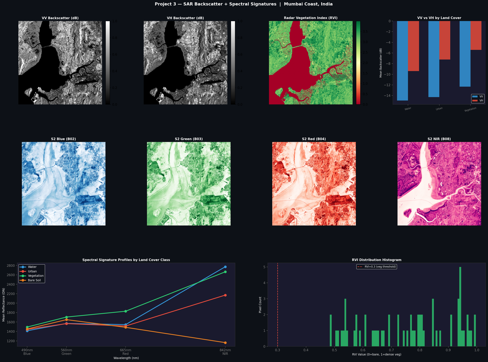

# SAR Backscatter Analysis & Spectral Signatures

One thing that kept coming up while working with SAR data was the question — *why does this surface look brighter than that one?* I understood the general idea (rough surfaces scatter more) but wanted to actually measure it across different land cover types and compare it to what the optical sensor sees at the same location.

This project is that investigation.

---

## Study Area

Mumbai Coast, India — chosen because it has a good mix of surfaces in a small area: open water (Arabian Sea), dense urban (Mumbai city), forest (Sanjay Gandhi National Park), and some dry terrain to the north.

---

## SAR Preprocessing

Raw Sentinel-1 GRD data needs processing before the pixel values mean anything physically. I ran the standard chain in ESA SNAP:

| Step | Why |
|------|-----|
| Apply Orbit File | Corrects satellite position errors |
| Radiometric Calibration | Converts raw digital numbers to sigma-0 (physical backscatter) |
| Speckle Filtering | Reduces radar noise while preserving edges |
| Terrain Correction | Removes geometric distortion from side-looking radar geometry |

Output: `SAR_TC.tif` — a 2-band GeoTIFF (VV, VH) in EPSG:32643

---

## Output Dashboard



---

## Backscatter Results

| Surface | Mean VV (dB) | What's happening physically |
|---------|-------------|----------------------------|
| Water | -11.49 | Specular reflection — flat surface bounces radar away from sensor |
| Urban | -13.95 | Double-bounce off buildings and ground |
| Vegetation | -14.94 | Volume scattering through canopy layers |
| Bare Soil | -19.36 | Diffuse surface scattering — lowest return |

---

## Radar Vegetation Index (RVI)

I also calculated RVI — a simple index that uses the ratio of cross-polarisation (VH) to total backscatter to estimate vegetation density:

```
RVI = (4 × VH) / (VV + VH)
```

Values near 0 = bare surface or water. Values near 1 = dense vegetation.

The scene mean was 0.748, which makes sense given how much of the study area is forested.

---

## Spectral Signatures

For the same land cover locations, I extracted Sentinel-2 reflectance values across Blue, Green, Red, and NIR bands. Each surface type has a characteristic curve — vegetation jumps sharply at NIR, water drops off, bare soil rises gradually.

Results are in `spectral_signatures.csv`.

---

## Scripts

| File | What it does |
|------|-------------|
| `p3_fast.py` | Loads SAR + S2, computes dB conversion, RVI, extracts class stats, plots dashboard |

```bash
python3.11 p3_fast.py
```

---

## Output Files

| File | Contents |
|------|---------|
| `P3_Backscatter_Analysis.png` | 3-row visual dashboard |
| `backscatter_stats.csv` | VV + VH mean, std, min, max per class |
| `spectral_signatures.csv` | S2 reflectance per class per band |

---

## Data

- Sentinel-2 L2A — Tile T43QBB, 25 Feb 2026 — https://dataspace.copernicus.eu
- Sentinel-1 IW-GRD — 19 Feb 2026 — https://dataspace.copernicus.eu
