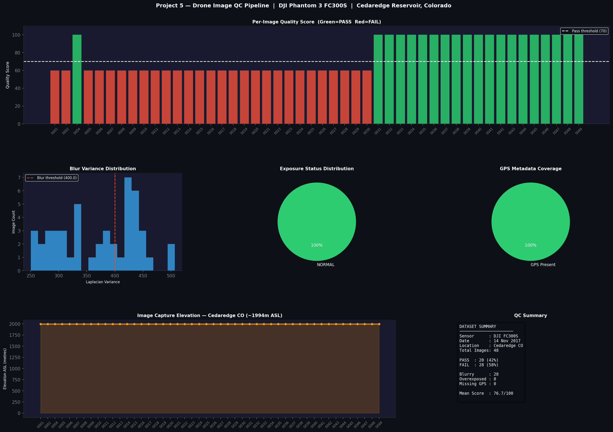

# Drone Image QC Pipeline

I came across a free drone survey dataset from DroneMapper — 48 images from a DJI Phantom 3 flying over a reservoir in Colorado. Instead of just looking at the images, I thought it would be more useful to write a script that inspects them automatically.

The question I wanted to answer: **can a script reliably flag bad images without a human looking at each one?**

---

## Dataset

**DJI Phantom 3 FC300S — 4th Ave Reservoir, Cedaredge, Colorado**
48 JPEG images captured on 14 November 2017
All images have embedded EXIF geo-tags (GPS + altitude + timestamp)

Source: https://dronemapper.com/sample_data/

---

## Output Dashboard



---

## How It Works

The script runs three independent checks on every image:

### Blur Detection — Laplacian Variance
```python
gray = cv2.cvtColor(img, cv2.COLOR_BGR2GRAY)
variance = cv2.Laplacian(gray, cv2.CV_64F).var()
```
A sharp image has strong edges — high variance. A blurry image has soft edges — low variance. Threshold: variance below 400 = BLURRY.

### Exposure Detection
```python
overexposed  = np.sum(img >= 250) / total * 100
underexposed = np.sum(img <= 10)  / total * 100
```
Counts pixels near the extremes of the brightness range. More than 1% saturated pixels = flagged.

### EXIF Metadata Validation
Reads GPS latitude, longitude, altitude, timestamp, and camera model from embedded EXIF tags. Flags any image where these are missing.

### Quality Score
Each image gets a score from 0 to 100 based on how many checks it passes. Score below 70 = FAIL.

---

## Results

| Check | Result |
|-------|--------|
| Total images | 48 |
| PASS | 20 (42%) |
| FAIL — motion blur | 28 (58%) |
| Overexposed | 0 |
| Missing GPS | 0 — 100% georeferenced |
| Mean quality score | 76.7 / 100 |

The 28 blurry images cluster at the start of the flight sequence — consistent with the drone still accelerating and turning before settling into the survey pattern.

All 48 images had complete GPS metadata, which makes sense for a professional survey dataset.

---

## Scripts

| File | What it does |
|------|-------------|
| `p5_drone_qc.py` | Runs all checks, generates dashboard, saves CSV report |

```bash
pip3.11 install opencv-python pillow exifread pandas matplotlib
python3.11 p5_drone_qc.py
```

---

## Output Files

| File | Contents |
|------|---------|
| `P5_Drone_QC_Dashboard.png` | 6-panel visual dashboard |
| `drone_qc_report.csv` | Per-image scores, flags, GPS, altitude, timestamp |
