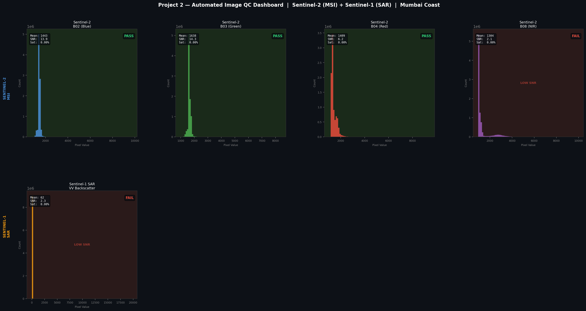

# Automated Image QC Dashboard

After working with satellite imagery for a while, I noticed I kept doing the same manual checks every time I loaded a new image — is this band saturated? Is there missing data? Does the histogram look normal?

So I wrote a script to automate it.

---

## What It Does

For each band in a satellite image, the script computes:

- **Mean and standard deviation** — is the radiometry in a normal range?
- **Saturation percentage** — what fraction of pixels are blown out?
- **No-data percentage** — are there missing or corrupt areas?
- **SNR (Signal-to-Noise Ratio)** — mean divided by standard deviation. A low value means the band is either very noisy or highly variable

It then applies thresholds and gives each band a PASS or FAIL, and generates a visual dashboard showing histograms for every band.

---

## Output



---

## Results

| Band | SNR | Status | Note |
|------|-----|--------|------|
| B02 Blue | 13.9 | ✅ PASS | Clean |
| B03 Green | 14.3 | ✅ PASS | Cleanest band in scene |
| B04 Red | 6.2 | ✅ PASS | Normal |
| B08 NIR | 2.1 | ⚠️ FAIL | High variance — see below |
| S1 VV | 2.3 | ⚠️ FAIL | SAR speckle — see below |

**On the NIR flag:** NIR reflectance varies a lot across mixed surfaces — urban, water, and vegetation all reflect NIR very differently. High standard deviation is expected for a heterogeneous scene. The flag is correct but not a data quality problem.

**On the S1 flag:** Raw SAR data has inherent speckle noise. This is a fundamental property of radar imaging, not a sensor fault. A speckle filter applied before QC would resolve this.

---

## Scripts

| File | What it does |
|------|-------------|
| `p2_qc_dashboard.py` | Runs all QC checks, generates dashboard, saves CSV logs |

```bash
python3.11 p2_qc_dashboard.py
```

---

## Output Files

| File | Contents |
|------|---------|
| `P2_QC_Dashboard.png` | Per-band histogram dashboard |
| `S2_QC_log.csv` | Sentinel-2 statistics |
| `S1_QC_log.csv` | Sentinel-1 statistics |
| `COMBINED_QC_log.csv` | Everything in one file with timestamps |

---

## Data

- Sentinel-2 L2A — Tile T43QBB, 25 Feb 2026 — https://dataspace.copernicus.eu
- Sentinel-1 IW-GRD — 19 Feb 2026 — https://dataspace.copernicus.eu
